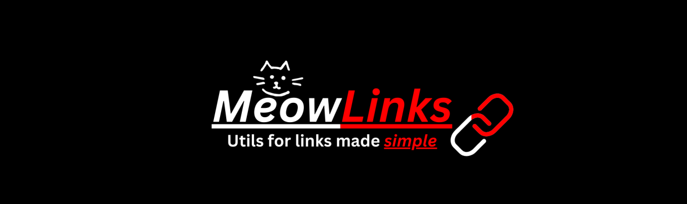

<div align="center">



[](https://github.com/EmersonYang3/MeowLinks)
</div>


## ✨ Features - All in one utility app for all your link needs!
- Link Shortener [in progress] [###-------]
- Link to QR Code [in progress] [----------]

## 🚀 Getting Started

```bash
# Clone the repository
git clone https://github.com/EmersonYang3/MeowLinks

# Navigate to the app
cd APP

# Install dependencies
npm install

# Start development server
npm run dev
```

## 🛠️ Tech Stack
- **[Vite](https://vitejs.dev/)** - Next Generation Frontend Tooling

## 📦 Releases

### v1.0.0 - DATE UNKNOWN

## 🗺️ Roadmap

Have a suggestion or problem? Message Me:

- 💬 Discord: `0x5f1fff9`

## 👥 Contributors
- Lucille - _Project Creator_

## ☕ Special Thanks
Thanks for checking out MeowLinks!

---